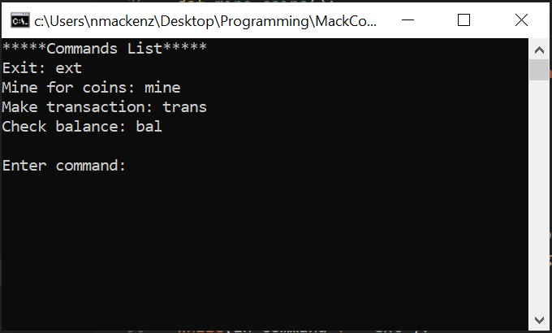

# MackCoin Cryptocurrency 

## Overview
Mackcoin is a simple cryptocurrency writtin in Python 3. At the moment the blockchain runs on a single machine and does not yet support peer-to-peer communications (note: this single-node blockchain has reduced security when compared to a decentralized, distributed blockchain). The client runs through a command line interface for easy operation. 

Feel free to use and refrence this code as needed in accordance to the MIT license.

## Operation
Initial start screen when launching the client.

  

List of input commands.

  

## Licence

MackCoin is [MIT licenced](LICENSE)

### Acknowledgments
[Michiel Mulders](https://github.com/michielmulders/blockgeeks-build-blockchain-javascript/blob/master/blockchain.js) over at Blockgeeks

[Dr. Michael Garbade](https://dzone.com/articles/how-to-create-your-own-cryptocurrency-blockchain-i) at DZone.com
